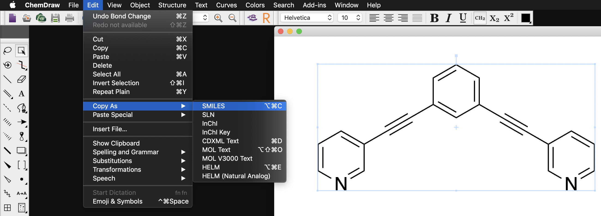

[](https://zenodo.org/badge/latestdoi/196167631)

### *C*a*g*e*Bind*ing: A tool to for automated metallocage binding affinity calculations
***

**cgbind** automates the process of generating M2L4 metallocage structures from just SMILES strings of the corresponding
linker (_L_). Binding affinity calculations may also be evaluated via input of both linker and substrate SMILES,
provided an installation of ORCA is available. 

***

## Requirements
0. Python v. 3.7
1. [rdkit](https://github.com/rdkit/rdkit)
2. matplotlib
3. [ORCA](https://sites.google.com/site/orcainputlibrary/home) v. 4.1 (optional)
4. [XTB](https://www.chemie.uni-bonn.de/pctc/mulliken-center/software/xtb/xtb) v. 6.1 (optional)
5. [MOPAC2016](http://openmopac.net) (optional)

***

## Installation

If the requirements are already satisfied
```
python setup.py install
```
Otherwise, see  _installation_ for how to install **cgbind** on Windows and Mac.

***

## Usage
### Generating SMILES strings
[SMILES](https://en.wikipedia.org/wiki/Simplified_molecular-input_line-entry_system) strings can be generated directly
from ChemDraw. For example:



### Using cgbind
To load as a module:
```python
import cgbind
```

See _examples/_ for how to use **cgbind**. 
