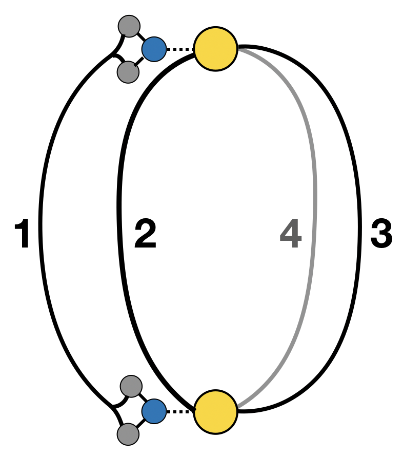
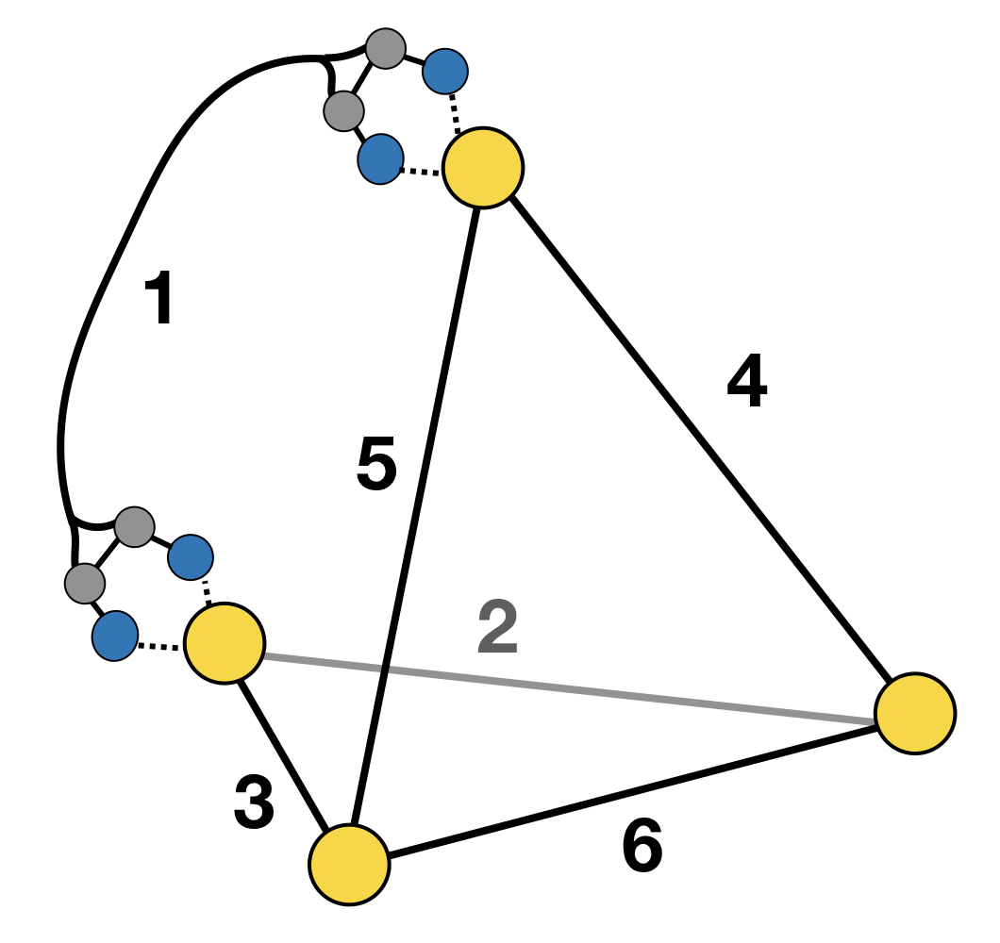

Architectures
=============

The architectures currently implemented in ``cgbind`` are listed below. Yellow, blue and grey atoms in the pictorial
representations are metals, donor atoms and x motif atoms respectively.

.. note::
   Architectures are added to ``cgbind`` are defined not only by their stoichiometry (MxLy) but also their donor
   atoms and nearest neighbors (termed Xmotifs) thus multiple architectures have the same stoichiometry

M2L4
----

The M2L4 architecture has ``arch_name='m2l4'`` and

M4L6
----

The catechol-derived M4L6 architecture has ``arch_name='m4l6'`` and

